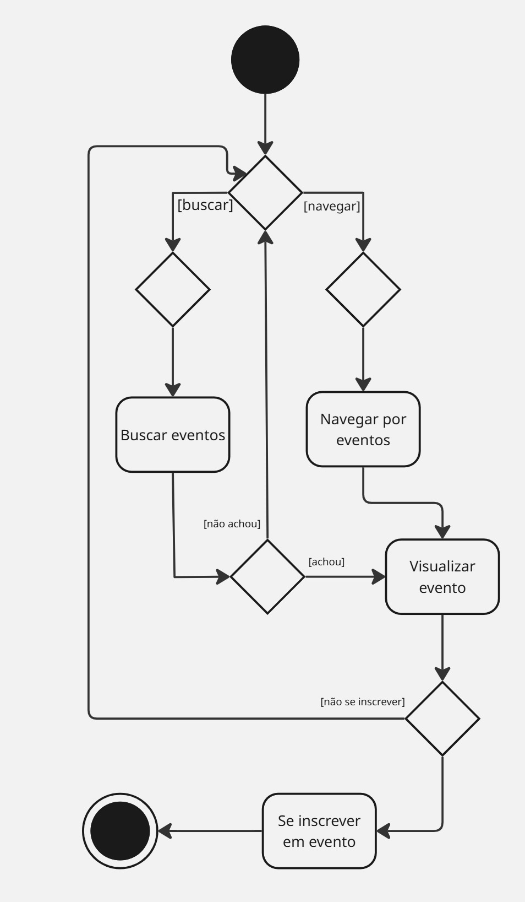

## Introdução
O diagrama de atividades é utilizado para modelar o fluxo de trabalho ou de processos dentro de um sistema. Ele descreve a sequência de ações realizadas, decisões tomadas e caminhos possíveis durante a execução de uma atividade, sendo útil tanto para representar processos de negócios quanto comportamentos de sistemas ou algoritmos.

Alguns dos componentes mais comuns de um diagrama de atividade incluem:
- Ações : uma etapa da atividade em que o usuário ou software realiza uma determinada tarefa, indicados por retângulos de cantos arredondados.
- Nó de decisão : um ramo condicional no fluxo representado por um diamante. Inclui uma única entrada e duas ou mais saídas.
- Fluxos de controle : outro nome dado aos conectores que mostram o fluxo entre as etapas no diagrama.
- Nó inicial : simboliza o início da atividade, representado por um círculo preto.
- Nó final : representa a etapa final da atividade, representado por um círculo preto delineado.

## Versão Inicial Diagrama de atividades 

 
<b>Figura 1 - Diagrama de Atividades</b>

 
 
 
 
<b>*Autor: <a href="https://github.com/AlexandreLJr">Alexandre Junior</a>*</b>

 

 
  

## Bibliografia 

> FAKHROUTDINOV Kirill. Activity Diagrams. uml-diagrams.org. Disponível em: <https://www.uml-diagrams.org/activity-diagrams.html>. Acesso em: 30 abr. 2025.

## Histórico de Versões

| Versão | Data       | Descrição               | Autor                                             | Revisor                                                | Comentário do Revisor |
| ------ | ---------- | ----------------------- | ------------------------------------------------- | ------------------------------------------------------ | --------------------- |
| `1.0`    | 17/04/2025 | Elaboração do esqueleto para entrega 2    |[Thales Euflauzino](https://github.com/thaleseuflauzino) | [Víctor Schmidt](https://github.com/moonshinerd)  | Aprovação do PR, ótimo trabalho |
| `1.1`    | 30/04/2025 | Adicionando introdução e bibliografia    |[Alexandre Junior](https://github.com/AlexandreLjr) | |  |
| `1.2`    | 30/04/2025 | Adicionando versão 1 do diagrama de atividades   |[Alexandre Junior](https://github.com/AlexandreLjr) | |  |