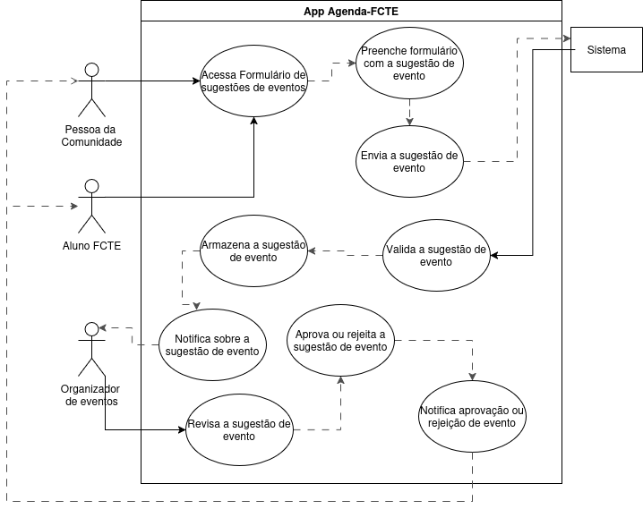

## Introdução

Um caso de uso detalha como o sistema é acionado em um contexto específico, descrevendo passo a passo a interação entre os usuários (atores) e o sistema até a realização de um objetivo pré‑definido. Seu principal papel é orientar o desenvolvimento, deixando claros os requisitos funcionais: o que o usuário pode fazer e como o sistema deve responder em cada etapa ([JACOBSON et al., 1992](#ref1)). 

## Metodologia

Para mapear as funcionalidades do sistema, usamos o diagrama de caso de uso, uma representação visual que destaca atores (usuários ou sistemas externos) e os casos de uso (ações que o sistema executa) ([SOMMERVILLE, 2011](#ref2)). 

Além disso, adotamos a persona [**Camila Duarte**](https://unbarqdsw2025-1-turma02.github.io/2025.1-T02-_G4_AgendaFCTE_Entrega_01/#/./Base/1.1.5.1.PerfilDeUsuarioEPersonas?id=camila-duarte) para alinhar cada caso de uso às necessidades reais dos usuários. Isso garante cenários mais verossímeis, levando em conta expectativas e desafios do perfil representado pela persona ([PRUITT; GRUDIN, 2002](#ref3)). 

A seguir, a Tabela 1 resume os principais elementos de um diagrama de caso de uso:

<b>Tabela 1</b>: Elementos do diagrama de casos de uso

| Nome | Função | Elemento
|------|------|:-------:
| Ator | Representam os diversos tipos de usuários externos que interagem com o sistema. | <figure style="width: 40%; display: flex; justify-content: center; background-color: white; padding: 5px;">  </figure>
| Elipse (Caso de Uso) | É utilizada para representar os casos de uso em um diagrama, destacando funcionalidades ou ações específicas que o sistema realiza em resposta às interações dos atores. A elipse identifica cada caso de uso, exibindo o nome correspondente em seu interior. | <figure style="width: 40%; display: flex; justify-content: center; background-color: white; padding: 10px;">  </figure>
| Retângulo (Sistema) | É utilizado para representar o sistema ou o componente em análise, agrupando os casos de uso e os atores associados a ele. | <figure style="width: 40%; display: flex; justify-content: center; background-color: white; padding: 10px;">  </figure>
| Flecha (Relações) | As setas são utilizadas para ilustrar as relações ou interações entre os atores e os casos de uso no diagrama. | <figure style="width: 40%; display: flex; justify-content: center; background-color: white; padding: 10px;">  </figure>

<b>*Autor: <a href="https://github.com/moonshinerd">Víctor Schmidt*</a></b>

### Detalhamento adicional

No diagrama de casos de uso, você também pode explicitar:

- **Requisitos externos**: funcionalidades essenciais que o sistema deve oferecer para satisfazer demandas dos usuários.  
- **Funcionalidades do sistema**: capacidades internas necessárias para atender essas demandas de forma eficiente.  
- **Requisitos ambientais**: condições ou restrições do ambiente onde o sistema opera, incluindo integrações e dependências externas.  

## Diagrama de Casos de Uso

 

**Diagrama 1** - <a id='quadro-caso-de-uso' href='https://app.diagrams.net/#G1OvxKGUKmt6cI1kB4XkXkrmrW_aqWq1Q3#%7B%22pageId%22%3A%22cuc-KDw1VMoB7bZAWTw1%22%7D'>Quadro de Casos de Uso no Draw.io</a>

  <iframe frameborder="0" style="width:100%;height:514px;" src="https://viewer.diagrams.net/?tags=%7B%7D&lightbox=1&highlight=0000ff&layers=1&nav=1&title=use-cases.drawio&dark=0#Uhttps%3A%2F%2Fdrive.google.com%2Fuc%3Fid%3D1OvxKGUKmt6cI1kB4XkXkrmrW_aqWq1Q3%26export%3Ddownload"></iframe>

### Registro 1

Este registro documenta a implementação dos requisitos **[RF01](https://unbarqdsw2025-1-turma02.github.io/2025.1-T02-_G4_AgendaFCTE_Entrega_01/#/./Base/1.5.3.PriorizacaoMosCoW?id=rf1)**, **[RF02](https://unbarqdsw2025-1-turma02.github.io/2025.1-T02-_G4_AgendaFCTE_Entrega_01/#/./Base/1.5.3.PriorizacaoMosCoW?id=rf2)**, **[RF03](https://unbarqdsw2025-1-turma02.github.io/2025.1-T02-_G4_AgendaFCTE_Entrega_01/#/./Base/1.5.3.PriorizacaoMosCoW?id=rf3)**, **[RF04](https://unbarqdsw2025-1-turma02.github.io/2025.1-T02-_G4_AgendaFCTE_Entrega_01/#/./Base/1.5.3.PriorizacaoMosCoW?id=rf4)**, **[RF09](https://unbarqdsw2025-1-turma02.github.io/2025.1-T02-_G4_AgendaFCTE_Entrega_01/#/./Base/1.5.3.PriorizacaoMosCoW?id=rf9)**, **[RF18](https://unbarqdsw2025-1-turma02.github.io/2025.1-T02-_G4_AgendaFCTE_Entrega_01/#/./Base/1.5.3.PriorizacaoMosCoW?id=rf18)** e **[RF22](https://unbarqdsw2025-1-turma02.github.io/2025.1-T02-_G4_AgendaFCTE_Entrega_01/#/./Base/1.5.3.PriorizacaoMosCoW?id=rf22)**, que envolvem:

- Visualização, pesquisa e compartilhamento de eventos;  
- Inscrição em eventos e acesso a sites de terceiros;  
- Resgate de ingressos (incluindo fluxo exclusivo para estudantes);  
- Inclusão de eventos inscritos na agenda do usuário.  

O diagrama abaixo ilustra o passo a passo dessas funcionalidades, conforme modelado por [Víctor Schmidt](https://github.com/moonshinerd). Os demais membros registraram seus próprios processos de forma individual ou colaborativa.

<a id="fig1">**Figura 1 – Registro 1**</a>

  

<b>*Autor: <a href="https://github.com/moonshinerd">Víctor Schmidt</a>*</b>

### Registro 2

Este registro descreve o cumprimento do requisito **[RF05](https://unbarqdsw2025-1-turma02.github.io/2025.1-T02-_G4_AgendaFCTE_Entrega_01/#/./Base/1.5.3.PriorizacaoMosCoW?id=rf5)**, relativo ao cadastro, edição e exclusão de eventos pelos organizadores.

O fluxo foi concebido individualmente por [Víctor Schmidt](https://github.com/moonshinerd), enquanto os demais integrantes documentaram seus registros de trabalho de maneira autônoma ou em equipe.

<a id="fig2">**Figura 2 – Registro 2**</a>

  

<b>*Autor: <a href="https://github.com/moonshinerd">Víctor Schmidt</a>*</b>

### Registro 3

Este registro descreve a modelagem dos fluxos referentes aos requisitos:

- [RF10](https://unbarqdsw2025-1-turma02.github.io/2025.1-T02-_G4_AgendaFCTE_Entrega_01/#/./Base/1.5.3.PriorizacaoMosCoW?id=rf10) – Filtrar eventos: permite ao usuário aplicar filtros por tipo, data ou local para refinar os eventos exibidos.
- [RF12](https://unbarqdsw2025-1-turma02.github.io/2025.1-T02-_G4_AgendaFCTE_Entrega_01/#/./Base/1.5.3.PriorizacaoMosCoW?id=rf12) e [RF24](https://unbarqdsw2025-1-turma02.github.io/2025.1-T02-_G4_AgendaFCTE_Entrega_01/#/./Base/1.5.3.PriorizacaoMosCoW?id=rf24) – Receber notificações de eventos: o sistema envia alertas relevantes ao usuário sobre eventos favoritos, próximos ou recomendados.
- [RF14](https://unbarqdsw2025-1-turma02.github.io/2025.1-T02-_G4_AgendaFCTE_Entrega_01/#/./Base/1.5.3.PriorizacaoMosCoW?id=rf14) – Favoritar evento: permite ao usuário marcar eventos como favoritos para acesso rápido ou personalização de conteúdo.
- [RF25](https://unbarqdsw2025-1-turma02.github.io/2025.1-T02-_G4_AgendaFCTE_Entrega_01/#/./Base/1.5.3.PriorizacaoMosCoW?id=rf25) – Indicar interesse ou presença: o usuário pode sinalizar se tem interesse ou confirmará presença em determinado evento.
- [RF28](https://unbarqdsw2025-1-turma02.github.io/2025.1-T02-_G4_AgendaFCTE_Entrega_01/#/./Base/1.5.3.PriorizacaoMosCoW?id=rf28) – Avaliar e comentar evento: após o evento, o usuário pode deixar comentários e avaliações públicas.

O fluxo representa ações de interação do usuário com a plataforma para personalização, engajamento e feedback sobre os eventos.

<a id="fig3">**Figura 3 - Registro 3**</a>

  

<b>*Autor: <a href="https://github.com/thaleseuflauzino">Thales Euflauzino</a>*</b>

### Registro 4

Este registro corresponde aos fluxos relacionados aos seguintes requisitos:

- [RF08](https://unbarqdsw2025-1-turma02.github.io/2025.1-T02-_G4_AgendaFCTE_Entrega_01/#/./Base/1.5.3.PriorizacaoMosCoW?id=rf8) - Definir limite de vagas: organizadores podem especificar o número máximo de participantes para um evento.
- [RF18](https://unbarqdsw2025-1-turma02.github.io/2025.1-T02-_G4_AgendaFCTE_Entrega_01/#/./Base/1.5.3.PriorizacaoMosCoW?id=rf18) - Visualizar lista de inscritos: os organizadores têm acesso à lista de usuários que se inscreveram no evento.

<a id="fig4">**Figura 4 - Registro 4**</a>

  

<b>*Autor: <a href="https://github.com/thaleseuflauzino">Thales Euflauzino</a>*</b>

### Registro 5

Este registro descreve a modelagem dos fluxos referentes aos requisitos:

- [RF06](https://unbarqdsw2025-1-turma02.github.io/2025.1-T02-_G4_AgendaFCTE_Entrega_01/#/./Base/1.5.3.PriorizacaoMosCoW?id=rf6) – Sugerir novos eventos: permite que os usuários proponham a criação de novos eventos, os quais podem ser analisados pelos organizadores.
- [RF15](https://unbarqdsw2025-1-turma02.github.io/2025.1-T02-_G4_AgendaFCTE_Entrega_01/#/./Base/1.5.3.PriorizacaoMosCoW?id=rf15) – Participar de fórum/comentários com moderação: possibilita a interação entre usuários e organizadores através de comentários públicos com moderação.
- [RF16](https://unbarqdsw2025-1-turma02.github.io/2025.1-T02-_G4_AgendaFCTE_Entrega_01/#/./Base/1.5.3.PriorizacaoMosCoW?id=rf16) – Denunciar evento inadequado: permite que o usuário reporte conteúdos ou eventos indevidos à moderação da plataforma.
- [RF19](https://unbarqdsw2025-1-turma02.github.io/2025.1-T02-_G4_AgendaFCTE_Entrega_01/#/./Base/1.5.3.PriorizacaoMosCoW?id=rf19) – Recomendação com base no perfil e histórico: o sistema personaliza a exibição de eventos de acordo com as preferências e interações anteriores do usuário.
- [RF26](https://unbarqdsw2025-1-turma02.github.io/2025.1-T02-_G4_AgendaFCTE_Entrega_01/#/./Base/1.5.3.PriorizacaoMosCoW?id=rf26) – Curtir evento: possibilita ao usuário expressar interesse e gerar impacto em futuras recomendações.
- [RF27](https://unbarqdsw2025-1-turma02.github.io/2025.1-T02-_G4_AgendaFCTE_Entrega_01/#/./Base/1.5.3.PriorizacaoMosCoW?id=rf27) – Marcar desinteresse: permite ao usuário sinalizar eventos que não deseja mais visualizar.
- [RF29](https://unbarqdsw2025-1-turma02.github.io/2025.1-T02-_G4_AgendaFCTE_Entrega_01/#/./Base/1.5.3.PriorizacaoMosCoW?id=rf29) – Requisitar participação ativa: permite ao usuário solicitar um espaço em eventos para apresentações ou colaborações, como saraus e rodas de conversa.

O fluxo representa ações de **personalização, engajamento, moderação de conteúdo e protagonismo do usuário** na plataforma, fortalecendo sua participação na construção da experiência de eventos.

<a id="fig5">**Figura 5 – Registro 5**</a>

  

<b>*Autora: <a href="https://github.com/rayenealmeida">Rayene Almeida</a>*</b>

### Registro 6

Este registro descreve a modelagem dos fluxos referentes aos requisitos:

- [RF11](https://unbarqdsw2025-1-turma02.github.io/2025.1-T02-_G4_AgendaFCTE_Entrega_01/#/./Base/1.5.3.PriorizacaoMosCoW?id=rf11) – O sistema deve permitir o cadastro de tags de interesse para personalizar recomendações de eventos.
- [RF13](https://unbarqdsw2025-1-turma02.github.io/2025.1-T02-_G4_AgendaFCTE_Entrega_01/#/./Base/1.5.3.PriorizacaoMosCoW?id=rf13) – O sistema deve ter um histórico de eventos para que o usuário acompanhe eventos passados, edições futuras e interações.
- [RF17](https://unbarqdsw2025-1-turma02.github.io/2025.1-T02-_G4_AgendaFCTE_Entrega_01/#/./Base/1.5.3.PriorizacaoMosCoW?id=rf17) – O aplicativo deve emitir certificados de participação em eventos, quando definido pelo organizador.
- [RF30](https://unbarqdsw2025-1-turma02.github.io/2025.1-T02-_G4_AgendaFCTE_Entrega_01/#/./Base/1.5.3.PriorizacaoMosCoW?id=rf30) – O sistema deve exibir fotos ou vídeos de edições anteriores dos eventos.

<a id="fig5">**Figura 6 – Registro 6**</a>

  

<b>*Autor: <a href="https://github.com/Victor-oss">Victório Lázaro</a>*</b>

### Registro 7

Este registro descreve a modelagem dos fluxos referentes aos requisitos:

- [RF23](https://unbarqdsw2025-1-turma02.github.io/2025.1-T02-_G4_AgendaFCTE_Entrega_01/#/./Base/1.5.3.PriorizacaoMosCoW?id=rf23) – O aplicativo deve permitir que os usuários sigam organizadores e páginas de eventos.
- [RF31](https://unbarqdsw2025-1-turma02.github.io/2025.1-T02-_G4_AgendaFCTE_Entrega_01/#/./Base/1.5.3.PriorizacaoMosCoW?id=rf31) – O aplicativo deve enviar notificações via WhatsApp ou outras redes sociais.

<a id="fig5">**Figura 7 – Registro 7**</a>

  

<b>*Autor: <a href="https://github.com/Victor-oss">Victório Lázaro</a>*</b>

### Registro 8

Este registro descreve a modelagem dos fluxos referentes aos requisitos:

- [RF07](https://unbarqdsw2025-1-turma02.github.io/2025.1-T02-_G4_AgendaFCTE_Entrega_01/#/./Base/1.5.3.PriorizacaoMosCoW?id=rf07) – Eventos podem ser marcados com até 6 meses de antecedência.
- [RF20](https://unbarqdsw2025-1-turma02.github.io/2025.1-T02-_G4_AgendaFCTE_Entrega_01/#/./Base/1.5.3.PriorizacaoMosCoW?id=rf20) – O sistema deve disponibilizar o contato do organizador para esclarecimento de dúvidas e informações adicionais.
- [RF21](https://unbarqdsw2025-1-turma02.github.io/2025.1-T02-_G4_AgendaFCTE_Entrega_01/#/./Base/1.5.3.PriorizacaoMosCoW?id=rf21) – O aplicativo deve permitir criação de perfis e autenticação dos usuários, inclusive por e-mail.

<a id="fig8">**Figura 8 – Registro 8**</a>

  

<b>*Autor: <a href="https://github.com/joaolucas102">João Lucas Costa</a>*</b>

## Referências Bibliográficas

> [<a id='ref1'>1</a>] JACOBSON, Ivar; CHRISTERSON, Magnus; JONSSON, Patrik; ÖVERGAARD, Gunnar. **Object‑oriented software engineering: a use case driven approach**. New York; Wokingham, Eng.; Reading, Mass.: ACM Press; Addison‑Wesley, 1992. Disponível em: <https://archive.org/details/ivar-jacobson-object-oriented-software-engineering-a-use-case-driven-approach-ac>. Acesso em: 19 abr. 2025.
>
> [<a id='ref2'>2</a>] SOMMERVILLE, Ian. *Software Engineering*. 9. ed. Boston: Addison‑Wesley, 2011. Cap. 5: System Modelling. Disponível em: <https://archive.org/details/sommerville-ian-engenharia-de-software-2011>. Acesso em: 19 abr. 2025.
>
> [<a id='ref3'>3</a>] PRUITT, John; GRUDIN, Jonathan. *Personas, Participatory Design and Product Development: An Infrastructure for Engagement*. In: BINDER, Thomas; GREGORY, Judith; WAGNER, Ina (eds.). Proceedings of the Participatory Design Conference, 7., 23–25 jun. 2002, Malmö, Sweden. Palo Alto, CA: CPSR, 2002. p. 144–161. Disponível em: <https://ojs.ruc.dk/index.php/pdc/article/view/249/241>. Acesso em: 19 abr. 2025. 

## Histórico de Versões

| Versão | Data | Descrição | Autor | Revisor | Comentário do Revisor |
| -- | -- | -- | -- | -- | -- |
| `1.0`    | 17/04/2025 | Elaboração do esqueleto para entrega 2    |[Thales Euflauzino](https://github.com/thaleseuflauzino) | [Víctor Schmidt](https://github.com/moonshinerd)  | Aprovação do PR, ótimo trabalho |
| `1.1`    | 19/04/2025 | Adicionando quadro de casos de uso no Draw.io para elaborar os casos de uso, adicionando introdução, metodologia e referências bibliográficas. Adicionando também tabela de Elementos do diagrama de casos de uso | [Víctor Schmidt](https://github.com/moonshinerd) | [Thales Euflauzino](https://github.com/thaleseuflauzino) | Boa organização! |
| `1.2`    | 19/04/2025 | Adicionando fluxos dos requisitos RF01, RF02, RF03, RF04, RF05, RF09, RF18 e RF22 e registrando autoria | [Víctor Schmidt](https://github.com/moonshinerd) | [Thales Euflauzino](https://github.com/thaleseuflauzino) | Bom trabalho! |
<<<<<<< Updated upstream
| `1.3`    | 20/04/2025 | Adicionando fluxos dos requisitos RF10, RF12, RF24, RF14, RF25, RF28 , RF08 e RF18 e registrando autoria | [Thales Euflauzino](https://github.com/thaleseuflauzino) | [Pedro Lopes](https://github.com/pLopess) |  |
| `1.4`    | 24/04/2025 | Adicionando fluxos dos requisitos  RF06, RF15, RF16, RF19, RF26, RF27 e RF29 e registrando autoria  | [Rayene Almeida](https://github.com/rayenealmeida) | [Pedro Lopes](https://github.com/pLopess) |  |
| `1.5`    | 29/04/2025 | Adicionando fluxos dos requisitos RF11, RF13, RF17, RF23, RF30 e RF31 e registrando autoria  | [Victório Lázaro](https://github.com/Victor-oss) | [Pedro Lopes](https://github.com/pLopess) |  |
| `1.6`    | 30/04/2025 | Adicionando fluxos dos requisitos RF07, RF20, RF21 e registrando autoria  | [João Lucas Costa](https://github.com/joaolucas102) | [Pedro Lopes](https://github.com/pLopess) | Bom trabalho, boa rastreabilidade e organização! |
| `1.7`    | 05/05/2025 | Atualizando imagem do registro 5  | [Rayene Almeida](https://github.com/rayenealmeida) |  |  |
