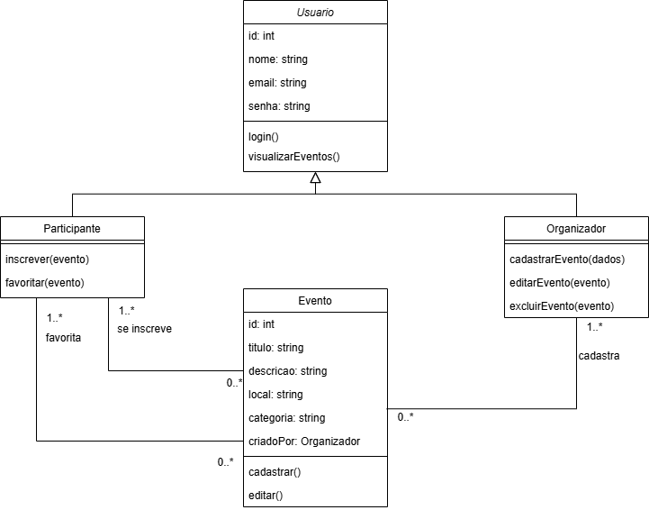
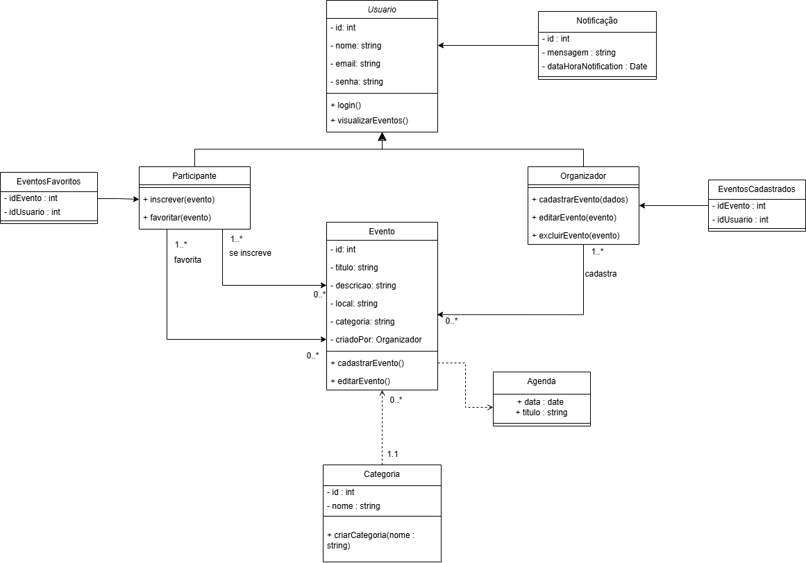

## Introdução

O diagrama de classes é um dos principais diagramas da UML (Unified Modeling Language) e é amplamente utilizado na modelagem de sistemas orientados a objetos. Ele tem como objetivo representar a estrutura estática do sistema, mostrando as classes, seus atributos, métodos e os relacionamentos entre elas. Por meio desse diagrama, é possível visualizar como os objetos do sistema se organizam e interagem, servindo como uma base sólida para o desenvolvimento do software.
Cada classe é representada por um retângulo dividido em três partes: o nome da classe, seus atributos (variáveis) e seus métodos (funções ou operações). Além disso, o diagrama de classes descreve diversos tipos de relacionamentos, como associação, agregação, composição, herança e dependência.

### Versão 01: 

Versão inicial do diagrama de classes do app Agenda UnB, contém as principais classes, seus atributos e métodos. Deve ser complementado com classes a mais que forem necessárias e os relacionamentos entre classes.

<b>Figura 1 - Diagrama de Classes</b>

<b>*Autor: <a href="https://github.com/pLopess">Pedro Lopes</a>*</b>

 

### Versão 02: 

Versão 2 do diagrama com algumas alterações realizadas, como adição de encapsulamento da versão 1 e outras classes e relacionamentos adicionadas.

<b>Figura 2 - Diagrama de Classes, versão 2</b>

<b>*Autor: <a href="https://github.com/AlexandreLJr">Alexandre Junior</a>*</b>

 

## Bibliografia 
> Lucid Software Inc. (s.d.). Lucidchart. O que é um diagrama de classe UML? Disponível em: https://unbarqdsw2024-2.github.io/2024.2_G6_Agenda_Entrega_02/#/./foco1/d_classes Acesso em 30 de abril de 2025.
>
> SERRANO Milene. 05b - VideoAula - DSW-Modelagem - Diagrama de Classe. Disponível na plataforma Aprender3. Acesso em 30 de abril de 2025.

## Histórico de Versões

| Versão | Data       | Descrição               | Autor                                             | Revisor                                                | Comentário do Revisor |
| ------ | ---------- | ----------------------- | ------------------------------------------------- | ------------------------------------------------------ | --------------------- |
| `1.0`    | 17/04/2025 | Elaboração do esqueleto para entrega 2    |[Thales Euflauzino](https://github.com/thaleseuflauzino) | [Víctor Schmidt](https://github.com/moonshinerd)  | Aprovação do PR, ótimo trabalho |
| `1.1`    | 30/04/2025 | Adicionando introdução e bibliografia    |[Alexandre Junior](https://github.com/AlexandreLJr) | [Pedro Lopes](https://github.com/pLopess) | Boa estrutura inicial |
| `1.2`    | 02/05/2025 | Adicionando diagrama de classes inicial  |[Pedro Lopes](https://github.com/pLopess) | [Victor Bernardes](https://github.com/VHbernardes) | Revisado e verificado, bom trabalho! |
| `1.3`    | 02/05/2025 | Adicionando versão 2 do diagrama de classes |[Alexandre Junior](https://github.com/AlexandreLJr) |[Victor Bernardes](https://github.com/VHbernardes) | Revisado e verificado, PR aprovado. Bom trabalho! |