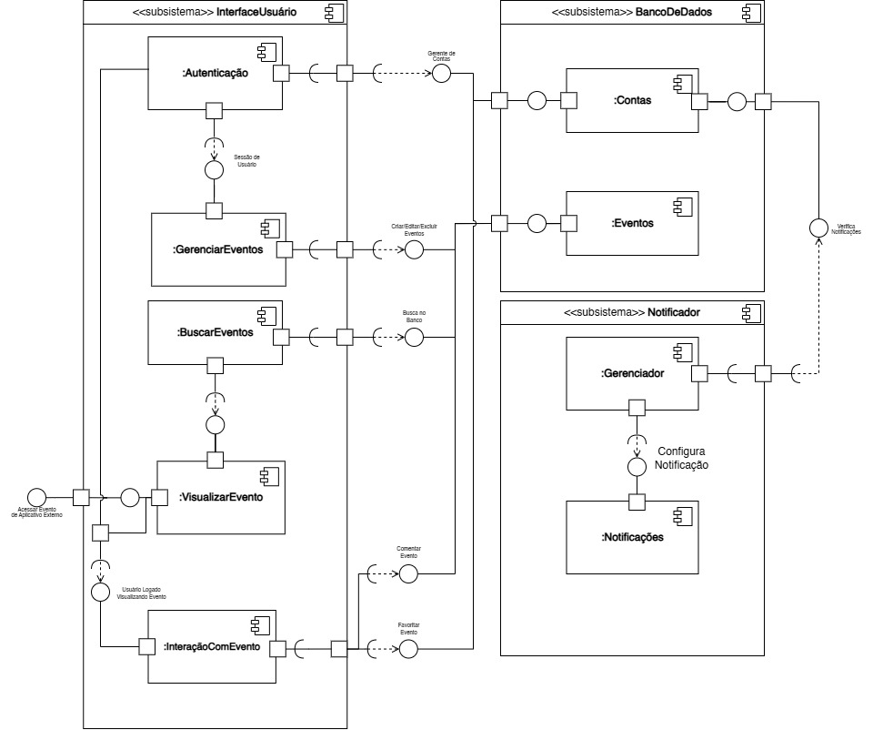

## Introdução

Os diagramas de componentes são um tipo de diagrama de estrutura que ilustram graficamente elementos implementáveis de um sistema, suas interfaces e inter-relações. Como artefato de nível de implementação estática, destacam componentes como unidades modulares com interfaces bem definidas e dependências explícitas. Essas representações facilitam a identificação de dependências, pontos de integração e canais de comunicação entre módulos, essenciais para a manutenção e escalabilidade de sistemas de grande porte ([BELL, 2004](#ref1)).

Em projetos corporativos e aplicações distribuídas em larga escala, os diagramas de componentes orientam arquitetos e equipes de desenvolvimento na definição de responsabilidades e na visualização de fronteiras de componentes, promovendo um planejamento colaborativo mais eficiente. Segundo [Ian Sommerville](#ref2), a modelagem de componentes favorece a modularidade e a reutilização de software, ao permitir que funcionalidades sejam encapsuladas em componentes independentes e facilmente substituíveis. Além disso, ao revelar de forma clara as dependências críticas, esses diagramas suportam atividades de revisão de arquitetura e mitigação de riscos durante todo o ciclo de vida do projeto ([SOMMERVILLE, 2011](#ref2)). As referências para a elaboração dos componentes deste diagrama de componentes foram obtidas no Lucidchart ([LUCIDCHART, s.d.](#ref3)).

## Diagrama de Componentes

<a id="diagrama1" href="https://app.diagrams.net/#G1wJfimSbmd4osOCK7qIIze7oAvEbS6VWN#%7B%22pageId%22%3A%225f0bae14-7c28-e335-631c-24af17079c00%22%7D" style="display: block; text-align: center;">
  <b>Diagrama 1</b> – Diagrama de Componentes
</a>

<iframe frameborder="0" style="width:100%;height:493px;" src="https://viewer.diagrams.net/?tags=%7B%7D&lightbox=1&highlight=000000&edit=https%3A%2F%2Fapp.diagrams.net%2F%23G1wJfimSbmd4osOCK7qIIze7oAvEbS6VWN%23%257B%2522pageId%2522%253A%25225f0bae14-7c28-e335-631c-24af17079c00%2522%257D&layers=1&nav=1&title=diagrama-componenete.drawio&dark=0#Uhttps%3A%2F%2Fdrive.google.com%2Fuc%3Fid%3D1wJfimSbmd4osOCK7qIIze7oAvEbS6VWN%26export%3Ddownload"></iframe>

# Registro 1

Este registro descreve a modelagem dos fluxos referentes aos requisitos:

- [RF01](https://unbarqdsw2025-1-turma02.github.io/2025.1-T02-_G4_AgendaFCTE_Entrega_01/#/./Base/1.5.3.PriorizacaoMosCoW?id=rf1) – Integração com outros sites ou apps de eventos, permitindo sincronizar informações e compromissos.  
- [RF04](https://unbarqdsw2025-1-turma02.github.io/2025.1-T02-_G4_AgendaFCTE_Entrega_01/#/./Base/1.5.3.PriorizacaoMosCoW?id=rf4) – Visualização de eventos com informações como data, hora, local, descrição, link de inscrição e contato.  
- [RF05](https://unbarqdsw2025-1-turma02.github.io/2025.1-T02-_G4_AgendaFCTE_Entrega_01/#/./Base/1.5.3.PriorizacaoMosCoW?id=rf5) – Cadastro, edição e exclusão de eventos pelos organizadores.
- [RF09](https://unbarqdsw2025-1-turma02.github.io/2025.1-T02-_G4_AgendaFCTE_Entrega_01/#/./Base/1.5.3.PriorizacaoMosCoW?id=rf9) – Busca de eventos por nome, local, data, tipo, categoria e tags.  
- [RF10](https://unbarqdsw2025-1-turma02.github.io/2025.1-T02-_G4_AgendaFCTE_Entrega_01/#/./Base/1.5.3.PriorizacaoMosCoW?id=rf10) – Filtrar e organizar eventos por tipo, data, localização, categoria, popularidade e hype.  
- [RF12](https://unbarqdsw2025-1-turma02.github.io/2025.1-T02-_G4_AgendaFCTE_Entrega_01/#/./Base/1.5.3.PriorizacaoMosCoW?id=rf12) – Envio de notificações sobre eventos de interesse do usuário, com base em localização, preferências ou favoritos.  
- [RF14](https://unbarqdsw2025-1-turma02.github.io/2025.1-T02-_G4_AgendaFCTE_Entrega_01/#/./Base/1.5.3.PriorizacaoMosCoW?id=rf14) – Permitir favoritar eventos para acompanhar novidades e receber notificações.  
- [RF21](https://unbarqdsw2025-1-turma02.github.io/2025.1-T02-_G4_AgendaFCTE_Entrega_01/#/./Base/1.5.3.PriorizacaoMosCoW?id=rf21) – Criação de perfis e autenticação dos usuários, inclusive por e‑mail.  
- [RF24](https://unbarqdsw2025-1-turma02.github.io/2025.1-T02-_G4_AgendaFCTE_Entrega_01/#/./Base/1.5.3.PriorizacaoMosCoW?id=rf24) – Cadastro e gerenciamento de notificações, com opções de ativação e personalização.  
- [RF28](https://unbarqdsw2025-1-turma02.github.io/2025.1-T02-_G4_AgendaFCTE_Entrega_01/#/./Base/1.5.3.PriorizacaoMosCoW?id=rf28) – Permitir que usuários comentem e avaliem eventos.

Ele registra o que foi feito na versão `1.1` pelo membro [Víctor Schmidt](https://github.com/moonshinerd) quanto ao diagrama de componentes.

<a id="fig1">**Figura 1 - Registro 1**</a>

  

<b>*Autor: <a href="https://github.com/moonshinerd">Víctor Schmidt</a>*</b>

# Registro 2

Este registro descreve a modelagem dos fluxos referentes aos requisitos:

- [RF03](https://unbarqdsw2025-1-turma02.github.io/2025.1-T02-_G4_AgendaFCTE_Entrega_01/#/./Base/1.5.3.PriorizacaoMosCoW?id=rf3) – Integração com agendas e mapas (Google Agenda, Outlook etc.), permitindo adicionar eventos e visualizar localização.
- [RF06](https://unbarqdsw2025-1-turma02.github.io/2025.1-T02-_G4_AgendaFCTE_Entrega_01/#/./Base/1.5.3.PriorizacaoMosCoW?id=rf6) – Permitir que usuários sugiram novos eventos, com possibilidade de moderação.
- [RF07](https://unbarqdsw2025-1-turma02.github.io/2025.1-T02-_G4_AgendaFCTE_Entrega_01/#/./Base/1.5.3.PriorizacaoMosCoW?id=rf7) – Eventos podem ser marcados com até 6 meses de antecedência.
- [RF11](https://unbarqdsw2025-1-turma02.github.io/2025.1-T02-_G4_AgendaFCTE_Entrega_01/#/./Base/1.5.3.PriorizacaoMosCoW?id=rf11) – Cadastro de tags de interesse para personalizar recomendações.
- [RF13](https://unbarqdsw2025-1-turma02.github.io/2025.1-T02-_G4_AgendaFCTE_Entrega_01/#/./Base/1.5.3.PriorizacaoMosCoW?id=rf13) – Histórico de eventos para acompanhar eventos passados e interações.
- [RF17](https://unbarqdsw2025-1-turma02.github.io/2025.1-T02-_G4_AgendaFCTE_Entrega_01/#/./Base/1.5.3.PriorizacaoMosCoW?id=rf17) – Emissão de certificados de participação (quando definido pelo organizador).
- [RF23](https://unbarqdsw2025-1-turma02.github.io/2025.1-T02-_G4_AgendaFCTE_Entrega_01/#/./Base/1.5.3.PriorizacaoMosCoW?id=rf23) – Seguir organizadores e páginas de eventos.
- [RF25](https://unbarqdsw2025-1-turma02.github.io/2025.1-T02-_G4_AgendaFCTE_Entrega_01/#/./Base/1.5.3.PriorizacaoMosCoW?id=rf25) – Indicar interesse ou confirmar presença em um evento.
- [RF26](https://unbarqdsw2025-1-turma02.github.io/2025.1-T02-_G4_AgendaFCTE_Entrega_01/#/./Base/1.5.3.PriorizacaoMosCoW?id=rf26) – Curtir eventos.

Ele registra o que foi feito na versão `1.2` e `1.3` pelo membro [Thales Euflauzino](https://github.com/thaleseuflauzino) quanto ao diagrama de componentes.

<a id="fig1">**Figura 2 - Registro 2**</a>

  

<b>*Autor: <a href="https://github.com/thaleseuflauzino">Thales Euflauzino</a>*</b>

# Registro 3

Este registro descreve a modelagem dos fluxos referentes aos requisitos:

- [RF02](https://unbarqdsw2025-1-turma02.github.io/2025.1-T02-_G4_AgendaFCTE_Entrega_01/#/./Base/1.5.3.PriorizacaoMosCoW?id=rf2) – Integração com redes sociais e outros canais para compartilhamento de eventos.  
- [RF08](https://unbarqdsw2025-1-turma02.github.io/2025.1-T02-_G4_AgendaFCTE_Entrega_01/#/./Base/1.5.3.PriorizacaoMosCoW?id=rf8) – Limitar quantidade de vagas por evento (definido por organizadores).  
- [RF15](https://unbarqdsw2025-1-turma02.github.io/2025.1-T02-_G4_AgendaFCTE_Entrega_01/#/./Base/1.5.3.PriorizacaoMosCoW?id=rf15) – Sistema de fóruns/comentários com moderação.  
- [RF16](https://unbarqdsw2025-1-turma02.github.io/2025.1-T02-_G4_AgendaFCTE_Entrega_01/#/./Base/1.5.3.PriorizacaoMosCoW?id=rf16) – Denúncia de eventos inadequados.  
- [RF18](https://unbarqdsw2025-1-turma02.github.io/2025.1-T02-_G4_AgendaFCTE_Entrega_01/#/./Base/1.5.3.PriorizacaoMosCoW?id=rf18) – Inscrição e resgate de ingressos.  
- [RF19](https://unbarqdsw2025-1-turma02.github.io/2025.1-T02-_G4_AgendaFCTE_Entrega_01/#/./Base/1.5.3.PriorizacaoMosCoW?id=rf19) – Recomendação de eventos baseada em preferências.  
- [RF20](https://unbarqdsw2025-1-turma02.github.io/2025.1-T02-_G4_AgendaFCTE_Entrega_01/#/./Base/1.5.3.PriorizacaoMosCoW?id=rf20) – Disponibilizar contato do organizador.  
- [RF22](https://unbarqdsw2025-1-turma02.github.io/2025.1-T02-_G4_AgendaFCTE_Entrega_01/#/./Base/1.5.3.PriorizacaoMosCoW?id=rf22) – Controle de acesso a eventos exclusivos (vinculados à UnB).  
- [RF27](https://unbarqdsw2025-1-turma02.github.io/2025.1-T02-_G4_AgendaFCTE_Entrega_01/#/./Base/1.5.3.PriorizacaoMosCoW?id=rf27) – Indicar desinteresse em eventos.  
- [RF29](https://unbarqdsw2025-1-turma02.github.io/2025.1-T02-_G4_AgendaFCTE_Entrega_01/#/./Base/1.5.3.PriorizacaoMosCoW?id=rf29) – Requisitar participação ativa (ex: apresentações).  
- [RF30](https://unbarqdsw2025-1-turma02.github.io/2025.1-T02-_G4_AgendaFCTE_Entrega_01/#/./Base/1.5.3.PriorizacaoMosCoW?id=rf30) – Exibir fotos/vídeos de edições anteriores.  
- [RF31](https://unbarqdsw2025-1-turma02.github.io/2025.1-T02-_G4_AgendaFCTE_Entrega_01/#/./Base/1.5.3.PriorizacaoMosCoW?id=rf31) – Notificações via WhatsApp/redes sociais.

Ele registra o que foi feito na versão `1.5` pelo membro [Rayene Almeida](https://github.com/rayenealmeida) quanto ao diagrama de componentes.

<a id="fig3">**Figura 3 - Registro 3**</a>

  

<b>*Autora: <a href="https://github.com/rayenealmeida">Rayene Almeida</a>*</b>

## Referências Bibliográficas

> [<a id='ref1'>1</a>] BELL, Donald. *UML basics: The component diagram*. IBM Developer, 15 dez. 2004. Disponível em: [https://developer.ibm.com/articles/the-component-diagram]. Acesso em: 20 abr. 2025.
> 
> [<a id='ref2'>2</a>] SOMMERVILLE, Ian. *Software Engineering*. 9. ed. Harlow: Addison‑Wesley, 2011. ISBN 978‑0‑13‑705346‑9. Disponível em: <https://engineering.futureuniversity.com/BOOKS%20FOR%20IT/Software-Engineering-9th-Edition-by-Ian-Sommerville.pdf>. Acesso em: 20 abr. 2025.
>
> [<a id='ref3'>3</a>] LUCIDCHART. *Diagrama de componentes UML: o que é, como fazer e exemplos*. s.l., s.d. Disponível em: <https://www.lucidchart.com/pages/pt/diagrama-de-componentes-uml>. Acesso em: 20 abr. 2025.

## Histórico de Versões

| Versão | Data | Descrição | Autor | Revisor | Comentário do Revisor |
| -- | -- | -- | -- | -- | -- |
| `1.0`    | 17/04/2025 | Elaboração do esqueleto para entrega 2 |[Thales Euflauzino](https://github.com/thaleseuflauzino) | [Víctor Schmidt](https://github.com/moonshinerd)  | Aprovação do PR, ótimo trabalho |
| `1.1`    | 21/04/2025 | Adição da introdução técnica sólida com fontes bibliográficas confiáveis.   Inserção e embedding do diagrama (com link e iframe).  Listagem e vinculo dos requisitos funcionais (RFs) modelados no diagrama na minha autoria.   Registrou sua contribuição com clareza na seção de versão.  Inserção da imagem do registro com legenda e autoria junto com texto justificativo. | [Víctor Schmidt](https://github.com/moonshinerd) |  |  |
| `1.2`    | 21/04/2025 | Adição dos requisitos escolhidos para a elaboração do diagrama de componentes. | [Thales Euflauzino](https://github.com/thaleseuflauzino) |  |  |
| `1.3`    | 21/04/2025 | Adição do registro da nova versão do diagrama de componentes. | [Thales Euflauzino](https://github.com/thaleseuflauzino) |  |  |
| `1.4`    | 05/05/2025 | Adição dos requisitos escolhidos para a elaboração do diagrama de componentes. | [Rayene Almeida](https://github.com/rayenealmeida) |  |  |
| `1.5`    | 07/05/2025 | Adição do registro da nova versão do diagrama de componentes. | [Rayene Almeida](https://github.com/rayenealmeida) |  |  |