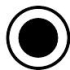
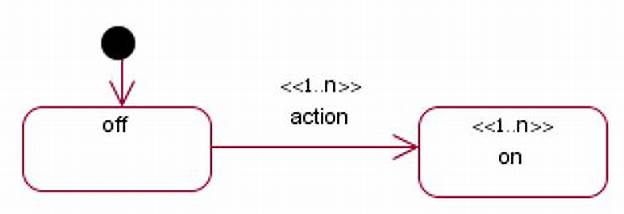

## Introdução

Os diagramas de máquina de estados são uma ferramenta fundamental na modelagem de software baseada em UML, empregados para capturar o comportamento dinâmico de sistemas orientados a objetos ao representar os diferentes estados pelos quais um elemento pode passar durante seu ciclo de vida e as transições acionadas por eventos e condições específicas (HAREL, 1987; BOOCH; RUMBAUGH; JACOBSON, 1999). Conforme a especificação da [Object Management Group (OMG)](#ref2), essa notação, derivada dos statecharts de Harel, oferece suporte à hierarquia de estados, paralelismo de regiões e ações associadas a entradas, saídas e transições, garantindo formalidade e clareza na representação do comportamento interno dos componentes e suportando ainda a análise sistemática de consistência por meio de matrizes de transição e diagramas de superestados ([CLARKE; GRUMBERG; PELED, 1999](#ref3)).

Ao estruturar graficamente o fluxo de controle e as reações a estímulos externos, os diagramas de estados facilitam a comunicação entre equipes de desenvolvimento e a detecção precoce de inconsistências ou comportamentos não desejados, sendo amplamente utilizados em sistemas reativos e embarcados de alta criticidade e adotados como padrão em metodologias de desenvolvimento ágil e formal. Além disso, a formalização das semânticas de execução possibilita a aplicação de técnicas de verificação automática e teste de modelos, contribuindo para a robustez e confiabilidade das soluções de software ([OBJECT MANAGEMENT GROUP, 2011](#ref4)).

<b>Tabela 1</b>: Elementos do Diagrama de Estados

| Nome | Função | Elemento
|------|------|:-------:
| Estado | ​A caixa de estados representa uma situação específica em que um objeto pode estar durante seu ciclo de vida, mostrando como ele reage a eventos e transita entre estados.  | <figure style="width: 100%; display: flex; justify-content: center; background-color: white; padding: 5px;">  </figure>
| Seta de Transição | ​A seta de transição indica a mudança de um estado para outro, acionada por um evento ou condição específica.​ | <figure style="width: 100%; display: flex; justify-content: center; background-color: white; padding: 10px;">  </figure>
| Estado Inicial | O estado inicial em um diagrama de estados representa o ponto de partida do ciclo de vida de um objeto ou sistema, indicando onde tudo começa. É simbolizado por um círculo sólido com uma seta apontando para o primeiro estado.​ | <figure style="width: 100%; display: flex; justify-content: center; background-color: white; padding: 10px;">  </figure>
| Exterminador (Estado Final) | ​O estado final representa o término do ciclo de vida de um objeto ou processo, indicando que ele não responderá mais a eventos futuros. É simbolizado por um círculo com outro círculo preenchido no centro.  | <figure style="width: 100%; display: flex; justify-content: center; background-color: white; padding: 10px;">  </figure>
| Estado Composto | ​O estado composto representa um estado que contém outros estados, permitindo modelar comportamentos complexos ou paralelos dentro de um único estado.   | <figure style="width: 100%; display: flex; justify-content: center; background-color: white; padding: 10px;">  </figure>
| Ação | Uma ação é uma operação executável e atômica que ocorre durante uma transição ou dentro de um estado, como chamar uma função ou enviar um sinal.   | <figure style="width: 100%; display: flex; justify-content: center; background-color: white; padding: 10px;">  </figure>

<b>*Autor: <a href="https://github.com/moonshinerd">Víctor Schmidt*</a></b>

## Referência Bibliográfica

> [<a id='ref1'>1</a>] LUCID SOFTWARE INC. _O que é um diagrama de máquina de estados?_ Lucidchart, 2025. Disponível em: https://www.lucidchart.com/pages/pt/o-que-e-diagrama-de-maquina-de-estados-uml. Acesso em: 21 abr. 2025.
>
> [<a id='ref2'>2</a>] OBJECT MANAGEMENT GROUP. *Unified Modeling Language® – Superstructure*. Version 2.5.1, Formal/2017‑12‑05. OMG, 2017. Disponível em: <https://www.omg.org/spec/UML/2.5.1/PDF>. Acesso em: 21 abr. 2025.
>
> [<a id='ref3'>3</a>] CLARKE, Edmund M.; GRUMBERG, Orna; PELED, Doron A. *Model Checking*. Cambridge, MA: MIT Press, 1999.
>
> [<a id='ref4'>4</a>] OBJECT MANAGEMENT GROUP. *Semantics of a Foundational Subset for Executable UML Models (fUML)*. Version 1.1, Formal/2011‑08‑05. OMG, 2011. Disponível em: <https://www.omg.org/spec/FUML/1.1>. Acesso em: 21 abr. 2025.

## Histórico de Versões

| Versão | Data | Descrição | Autor | Revisor | Comentário do Revisor |
| -- | -- | -- | -- | -- | -- |
| `1.0`    | 17/04/2025 | Elaboração do esqueleto para entrega 2    |[Thales Euflauzino](https://github.com/thaleseuflauzino) | [Víctor Schmidt](https://github.com/moonshinerd)  | Aprovação do PR, ótimo trabalho |
| `1.1`    | 21/04/2025 | Adicionando introdução, referências bibliográficas e tabela 1 com os elementos do diagrama de estados    | [Víctor Schmidt](https://github.com/moonshinerd) |   |  |