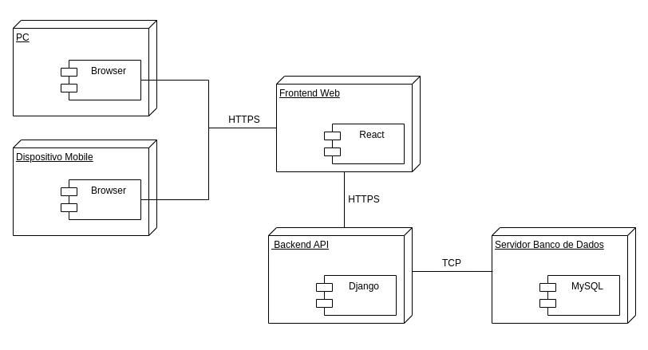

## Introdução

O diagrama de implementação/implantação descreve a implementação física de informações geradas pelo programa de software em componentes de hardware. As caixas tridimensionais conhecidas como nódulos, representam os elementos básicos de software ou hardware, ou nódulos no sistema. As linhas de nódulo a nódulo indicam relacionamentos e as formas menores contidas dentro das caixas representam os artefatos de software empregados ([LUCIDCHART, s.d.](#ref1)).

## Diagrama de Implantação

Esse diagrama foi feito com base nas tecnologias escolhidas após elaboração do [Quadro de Conhecimentos da Equipe](./Modelagem/quadroConhecimento.md), com o MySQL escolhido para ser o SGBD usado pela equipe, o Django para desenvolvimento da API e o React para elaboração do frontend da aplicação.

<b>Figura 1 - Diagrama de Implantação</b>

<b>*Autor: <a href="https://github.com/Victor-oss">Victório Lázaro</a>*</b>

## Referências Bibliográficas

> [<a id='ref1'>1</a>] LUCIDCHART. *O que é um diagrama de implementação?*. s.l., s.d. Disponível em: <https://www.lucidchart.com/pages/pt/o-que-e-diagrama-de-implementacao-uml>. Acesso em: 01 mai. 2025.
> [<a id='ref2'>2</a>] UML DIAGRAMS. *Package Diagrams Overview. UML Diagrams*, 2009. Disponível em: <https://www.uml-diagrams.org/deployment-diagrams-overview.html>. Acesso em: 31 abr. 2025.

## Histórico de Versões

| Versão | Data       | Descrição               | Autor                                             | Revisor                                                | Comentário do Revisor |
| ------ | ---------- | ----------------------- | ------------------------------------------------- | ------------------------------------------------------ | --------------------- |
| `1.0`    | 17/04/2025 | Elaboração do esqueleto para entrega 2    |[Thales Euflauzino](https://github.com/thaleseuflauzino) | [Víctor Schmidt](https://github.com/moonshinerd)  | Aprovação do PR, ótimo trabalho |
| `1.1`    | 01/05/2025 | Adição do diagrama de implantação  |[Victório Lázaro](https://github.com/Victor-oss) | | |