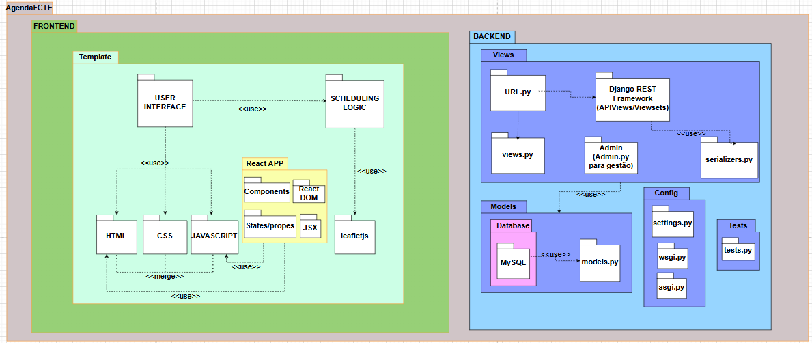

## Introdução

O diagrama de pacotes é um dos diagramas estruturais da UML utilizados para representar a organização e a divisão de um sistema em pacotes lógicos. Esses pacotes agrupam elementos relacionados, como classes, interfaces e outros artefatos, facilitando a compreensão da arquitetura geral do sistema. Através da visualização hierárquica, é possível identificar claramente as dependências e relacionamentos entre diferentes partes do software.

Esse tipo de diagrama é permite uma modelagem modular e escalável. Ao representar as interações entre os pacotes, o diagrama contribui para uma melhor organização do código-fonte e promove práticas de desenvolvimento orientadas à separação de responsabilidades e reutilização de componentes.

## Elementos 

Os principais elementos de um diagrama de pacotes são:

- Pacote (Package): Representado como uma pasta, o pacote é utilizado para agrupar elementos relacionados, como classes, interfaces ou outros pacotes. Ele ajuda a estruturar o sistema de forma hierárquica e modular.

- Dependência (Dependency): Representada por uma seta tracejada, indica que um pacote depende de outro para funcionar corretamente. Isso significa que há algum tipo de relacionamento ou uso entre os elementos internos desses pacotes.

- Importação (Import): Também indicada por uma seta tracejada, com a palavra-chave <<import>>, mostra que um pacote importa elementos de outro pacote para utilizá-los em seu próprio contexto.

- Acesso (Access): Representado com a palavra-chave <<access>>, esse tipo de dependência indica que um pacote pode acessar os elementos públicos de outro pacote, sem necessariamente importar todos os seus recursos.

## Camadas

### Model
É a parte responsável pela lógica de negócio do projeto e pelo gerenciamento dos dados da aplicação. Atua como intermediária entre o banco de dados e a camada de visualização (View). Sua principal função é permitir a criação, leitura, atualização e exclusão (CRUD) de informações, garantindo a integridade e consistência dos dados durante essas operações.

### View
É responsável pela apresentação das informações ao usuário. Ela recebe os dados processados pela Model e os formata para exibição, utilizando templates apropriados para renderizar a resposta. A View não deve conter lógica de negócio, mas sim controlar como os dados são apresentados, funcionando como uma ponte entre a Model e a interface do usuário.

### Template
É encarregado da estrutura e do layout visual da interface. Contém os arquivos HTML, CSS e, quando aplicável, frameworks como Bootstrap para estilização. Os templates são utilizados pela View para renderizar o conteúdo visual de forma consistente, separando a lógica de apresentação da estrutura de design.

### Config
É a camada responsável pela configuração central da aplicação. Ela define os parâmetros fundamentais que orientam o funcionamento do projeto Django, como as definições de banco de dados, middleware, rotas de arquivos estáticos, segurança, e integrações com bibliotecas externas. Essa camada também inclui arquivos essenciais para o deployment da aplicação, como wsgi.py e asgi.py, que servem como pontos de entrada para servidores web. Sua principal função é garantir que todas as partes do sistema operem de maneira coordenada e conforme os requisitos do ambiente (desenvolvimento, testes ou produção).

## Resultados

A seguir, tem-se o Diagrama de Pacotes da AgendaFCTE dividido em Backend e Frontend.

<a id="fig1">**Figura 1 - Diagrama de Pacotes**</a>

  

<b>*Autores: <a href="https://github.com/AlexandreLJr">Alexandre Junior, </a><a href="https://github.com/manu-sgc">Manoela Garcia, </a><a href="https://github.com/maykonjuso">Maykon Júnio, </a><a href="https://github.com/pLopess">Pedro Lopes, </a><a href="https://github.com/VHbernardes">Victor Bernardes</a>*</b>

A seguir, tem-se a descrição detalhada a arquitetura do sistema *AgendaFCTE, representada no diagrama de pacotes baseado no padrão* *MVT (Model-View-Template)* do Django, integrando o *Django REST Framework (DRF)*.

### Frontend

#### TEMPLATE

Esta seção representa a interface com o usuário (UI), estruturada da seguinte forma:

**USER INTERFACE**: Responsável por exibir os elementos visuais e permitir a interação do usuário. Está composta por:

- HTML – estrutura da página.
- CSS – estilização visual.
- JAVASCRIPT – interatividade.
- REACT – componentes reutilizáveis e dinâmicos, integrados aos templates para maior interatividade.

**SCHEDULING LOGIC**: Contém a lógica de agendamento e controle da interface, utilizando scripts como:

- template.js – responsável pela manipulação dinâmica da interface e eventuais requisições ao backend.
- componentes React – gerenciam estados e comportamentos interativos da interface de forma modular.

### Backend

Organizado em pacotes lógicos que representam as responsabilidades da aplicação:

#### Views (Camada de Visualização)

**urls.py**: Define as rotas (endpoints) da aplicação, redirecionando requisições para as views correspondentes.

**views.py**: Contém funções ou classes que manipulam as requisições tradicionais da web. Comunica-se diretamente com os models e renderiza templates.

**Django REST Framework (APIView / ViewSet)**: Views especializadas em APIs. Trabalha com serializers.py para enviar ou receber dados no formato JSON.

**admin.py**: Interface administrativa gerada automaticamente pelo Django. Utilizada para criação, edição e visualização de dados baseados nos models.

**serializers.py**: Componente do Django REST Framework. Transforma dados dos modelos em JSON (serialização) e dados JSON em objetos Python (desserialização). Facilita a comunicação entre o backend e o frontend (especialmente no uso com APIs).

#### Models (Camada de Dados)

**models.py**: Define as classes que representam as tabelas do banco de dados (ORM). Utilizado tanto nas views quanto no DRF e no admin.

**Banco de Dados (MySQL)**: Armazena os dados estruturados da aplicação. Conectado diretamente aos modelos definidos no models.py.

#### Configuração

**settings.py**: Arquivo principal de configuração do Django: apps, banco de dados, permissões, integração com DRF, etc.

**wsgi.py e asgi.py**: Interfaces de entrada para servidores web. wsgi.py é usado em aplicações síncronas tradicionais. asgi.py é usado quando há necessidade de suporte a WebSockets e requisições assíncronas

#### Testes

**tests.py**: Contém os testes automatizados da aplicação. Pode incluir testes de unidade, integração e funcionais.

### Conexões e Fluxos

- urls.py → views.py: as rotas são associadas a views que processam as requisições.
- views.py → models.py: as views acessam os dados através dos modelos.
- views.py → admin.py: o Django Admin usa os modelos para exibir dados na interface administrativa.
- DRF → serializers.py → models.py: o DRF utiliza os serializers para converter dados entre objetos Python e JSON.
- models.py → MySQL: os modelos refletem e interagem com as tabelas do banco de dados.

## Gravação
Segue a gravação do grupo se reunindo para fazer o Diagrama de Pacotes do dia 29/04/2025.

[Gravação do vídeo](https://youtu.be/cuPVdnlGUGg)
<iframe width="560" height="315" src="https://www.youtube.com/embed/cuPVdnlGUGg" title="Reunião Diagrama de Pacotes" frameborder="0" allow="accelerometer; autoplay; clipboard-write; encrypted-media; gyroscope; picture-in-picture; web-share" referrerpolicy="strict-origin-when-cross-origin" allowfullscreen></iframe>

<b>*Autores: <a href="https://github.com/AlexandreLJr">Alexandre Junior, </a><a href="https://github.com/manu-sgc">Manoela Garcia, </a><a href="https://github.com/maykonjuso">Maykon Júnio, </a><a href="https://github.com/pLopess">Pedro Lopes, </a><a href="https://github.com/VHbernardes">Victor Bernardes</a>*</b>

## Referências Bibliográficas

> [<a id='ref1'>1</a>] UML DIAGRAMS. *Package Diagrams Overview. UML Diagrams*, 2009. Disponível em: <https://www.uml-diagrams.org/package-diagrams-overview.html>. Acesso em: 31 abr. 2025.

## Histórico de Versões

| Versão | Data       | Descrição               | Autor                                             | Revisor                                                | Comentário do Revisor |
| ------ | ---------- | ----------------------- | ------------------------------------------------- | ------------------------------------------------------ | --------------------- |
| `1.0`    | 17/04/2025 | Elaboração do esqueleto para entrega 2    |[Thales Euflauzino](https://github.com/thaleseuflauzino) | [Víctor Schmidt](https://github.com/moonshinerd)  | Aprovação do PR, ótimo trabalho |
| `1.1`    | 29/04/2025 | Introdução e  Camadas MVT |[Pedro Lopes](https://github.com/pLopess) | [Alexandre Junior](https://github.com/AlexandreLJr)  | Interface funcionando e bom texto adicionado  |
| `1.2`    | 29/04/2025 | Adicionando explicação de elementos |[Alexandre Junior](https://github.com/AlexandreLJr) |  |  |
| `1.3`    | 02/05/2025 | Adição de mais uma camada e da explicação da imagem |[Manoela Garcia](https://github.com/manu-sgc) |  |  |
| `1.4`    | 02/05/2025 | Adição do diagrama de pacotes |[Victor Bernardes](https://github.com/VHbernardes) |  |  |
| `1.5`    | 03/05/2025 | Adição da gravação |[Manoela Garcia](https://github.com/manu-sgc) |  |  |