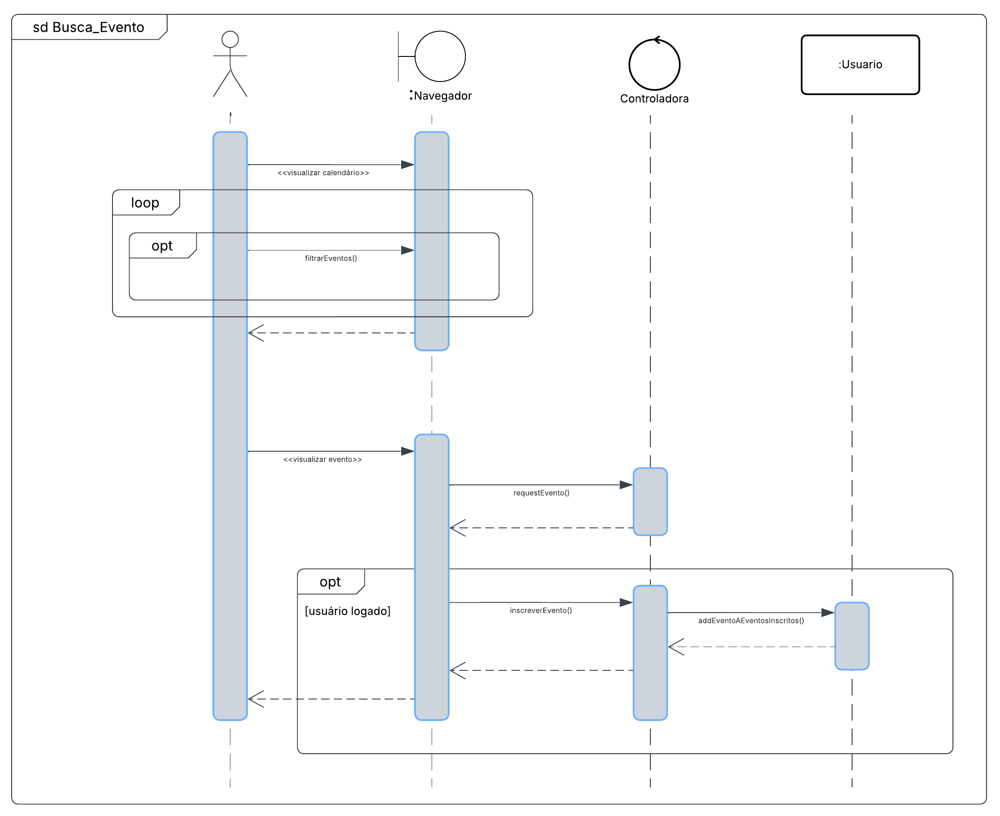

## Introdução

O diagrama de sequência é utilizado principalmente para mostrar as interações entre objetos na ordem em que ocorrem. Embora muitos desenvolvedores acreditem que esses diagramas são feitos apenas para eles, esses diagramas são úteis tanto para análise de requisitos quanto para design e documentação de sistemas, novos ou existentes ([BELL, 2023](#ref1)).

## Diagrama de Sequência

Na primeira imagem, representamos tanto o fluxo de inscrição em um evento quanto o de busca por um evento. Para esse fluxo, é necessário que o usuário esteja logado. O diagrama apresenta duas seções do sistema, Navegador (representando as principais views) e Controladora, as quais o usuário interage e realiza requisições. É possível notar que há um loop como fluxo alternativo, em que o usuário pode filtrar os eventos dentro da plataforma. Também, é possível o usuário requisitar a visualização de detalhes de um evento, para que assim possa se inscrever nele.

Outrossim, destaca-se que todo esse fluxo já considera a existência de uma classe Usuário, a qual não apresenta dependência alguma com os outros elementos do diagrama.

<a id="diagramaseq1">**Figura 1 - Diagrama de Sequência - Fluxo de Busca e Inscrição em Evento**</a>

  

<b>*Autor: <a href="https://github.com/Victor-oss">Victório Lázaro</a>*</b>

## Referências Bibliográficas

> [<a id='ref1'>1</a>] BELL, Donald. *Explore the UML sequence diagram*. IBM Developer, 09 out. 2023. Disponível em: <https://developer.ibm.com/articles/the-sequence-diagram/?mhsrc=ibmsearch_a&mhq=sequence%20diagram&mhp=0/>. Acesso em: 21 abr. 2025.
>

## Histórico de Versões

| Versão | Data       | Descrição               | Autor                                             | Revisor                                                | Comentário do Revisor |
| ------ | ---------- | ----------------------- | ------------------------------------------------- | ------------------------------------------------------ | --------------------- |
| `1.0`    | 17/04/2025 | Elaboração do esqueleto para entrega 2    |[Thales Euflauzino](https://github.com/thaleseuflauzino) | [Víctor Schmidt](https://github.com/moonshinerd)  | Aprovação do PR, ótimo trabalho |
| `1.1`    | 21/04/2025 | Adição do diagrama de esquema para busca e inscrição de eventos   |[Victório Lázaro](https://github.com/Victor-oss) |  | |