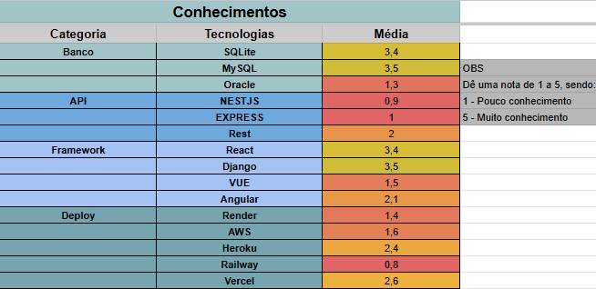

# Quadro de Conhecimentos

## Introdução
Para facilitar a distribuição de tarefas, promover a colaboração e identificar oportunidades de aprendizado entre os membros, é essencial mapear previamente o nível de familiaridade de cada integrante com as tecnologias envolvidas no projeto.

Neste contexto, a utilização de um quadro de conhecimentos permite uma visualização clara e objetiva das competências técnicas da equipe. Por meio dele, é possível alinhar as expectativas, dividir as responsabilidades de forma mais justa e estratégica, além de direcionar ações de apoio e capacitação. Com isso, busca-se não apenas o melhor aproveitamento dos talentos individuais, mas também o fortalecimento do trabalho em grupo, promovendo um ambiente colaborativo e eficiente.

## Quadro de Conhecimentos

Foi elaborada uma [Planilha Colaborativa](https://docs.google.com/spreadsheets/d/1TP2uG2DvR7LTbJeLcpTEE5SZguJ76Jt7TaHyzsq_Zm0/edit?usp=sharing) onde cada integrante acessou sua respectiva aba e atribuiu uma nota de 1 a 5 para cada tecnologia, onde 1 representa baixo conhecimento e 5 representa domínio. A partir dessas notas, a página principal da planilha foi configurada para calcular automaticamente a média das avaliações em cada habilidade, permitindo uma visão geral da distribuição de conhecimentos dentro do grupo.

  
<b>Autor:</b> <a href="https://www.github.com/manu-sgc">Manoela Garcia</a>

## Resultados

Com base nos resultados obtidos na planilha de mapeamento de habilidades, foram identificadas as tecnologias que o grupo possui maior familiaridade. A partir dessa análise, definiu-se que:

- O banco de dados utilizado será o MySQL;
- A API será construída no padrão REST;
- O framework escolhido para o desenvolvimento será o Django;
- O deploy será feito no Heroku ou Vercel, de acordo com a necessidade e as características específicas do projetod.

Vale destacar que essas decisões são baseadas no cenário atual, mas podem ser reavaliadas e ajustadas ao longo do desenvolvimento, conforme as necessidades técnicas do projeto e o aprendizado da equipe evoluírem.

## Histórico de Versões

| Versão | Data       | Descrição               | Autor                                             | Revisor                                                | Comentário do Revisor |
| ------ | ---------- | ----------------------- | ------------------------------------------------- | ------------------------------------------------------ | --------------------- |
| `1.0`    | 17/04/2025 | Elaboração do esqueleto para entrega 2    |[Thales Euflauzino](https://github.com/thaleseuflauzino) | [Víctor Schmidt](https://github.com/moonshinerd)  | Aprovação do PR, ótimo trabalho |
| `1.1`    | 23/04/2025 | Quadro de conhecimentos adicionado |[Alexandre Junior](https://github.com/AlexandreLJr) |  |  |
| `1.2`    | 23/04/2025 | Adição de texto explicativo do quadro e dos resultados |[Manoela Garcia](https://github.com/manu-sgc) |  |  |
| `1.3`    | 24/04/2025 | Troca da imagem do quadro com novos resultados e adição do link do google sheets |[Manoela Garcia](https://github.com/manu-sgc) |  |  |